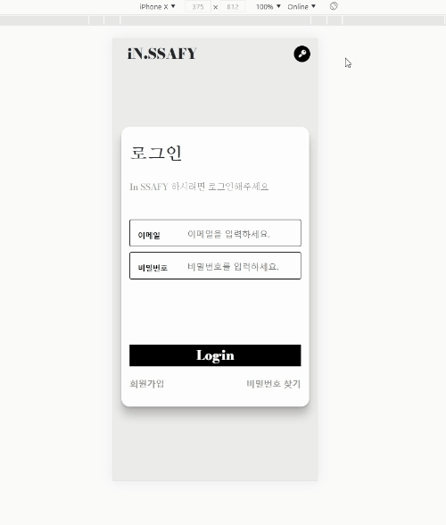
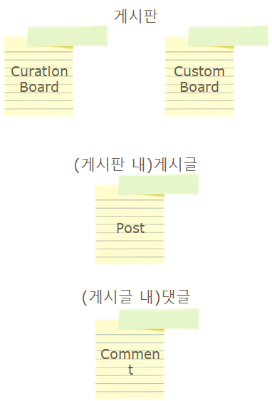
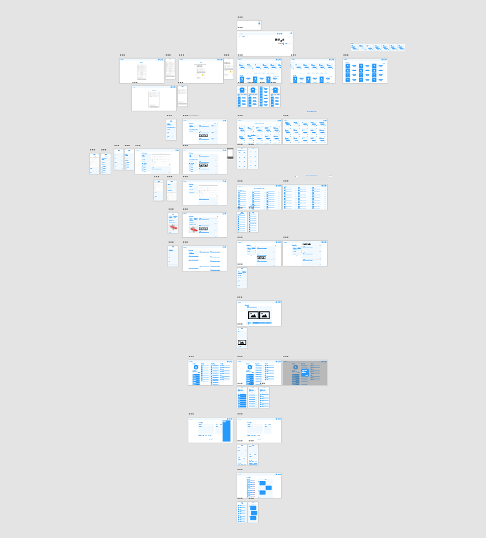
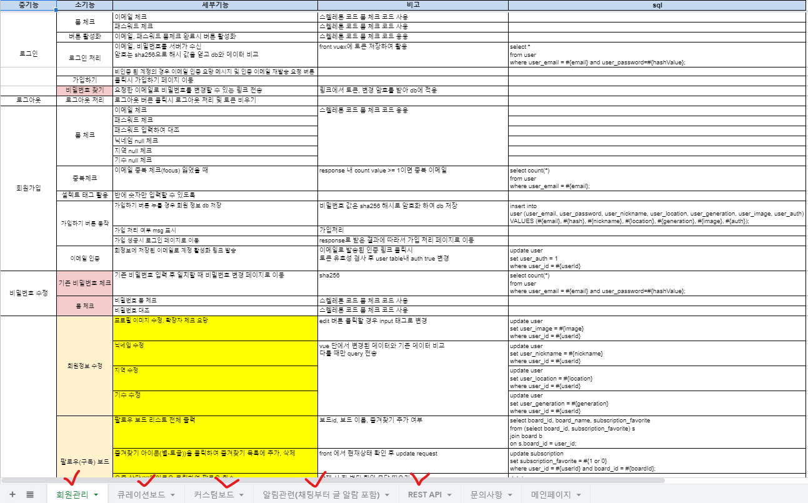
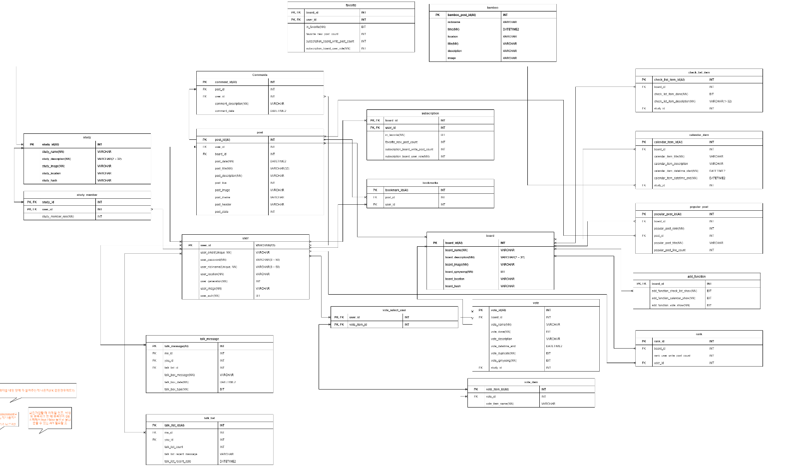
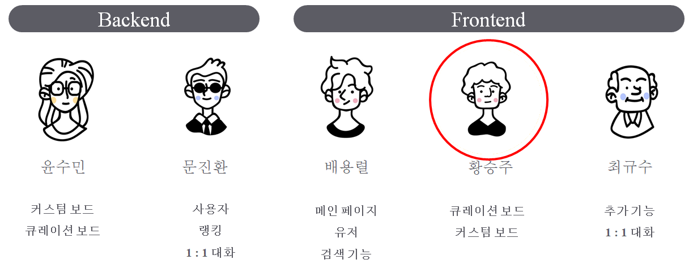
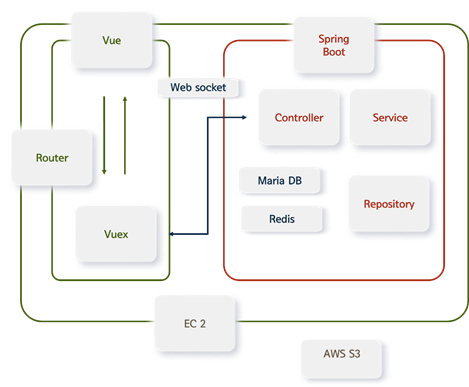
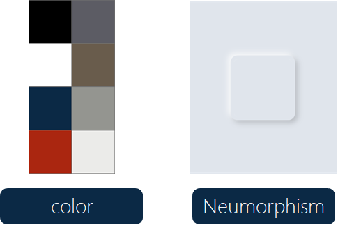
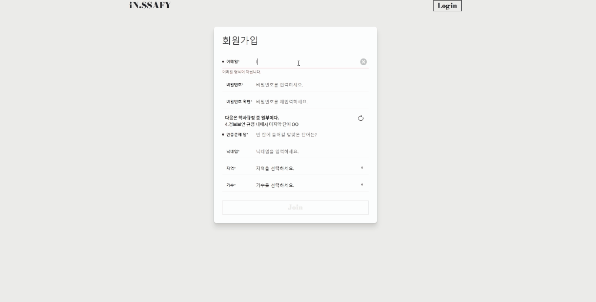
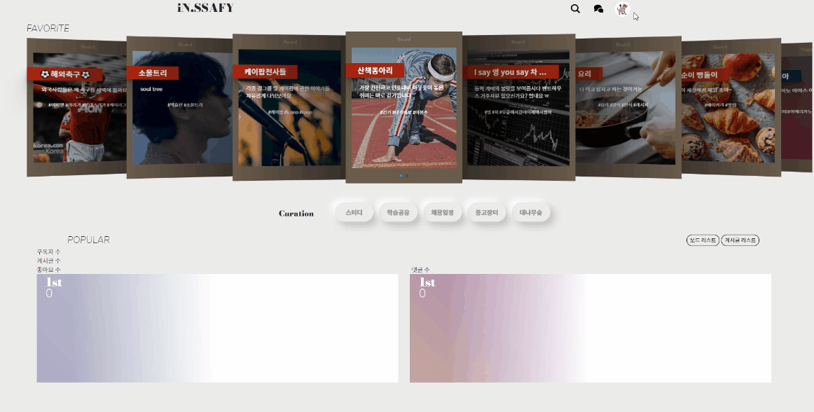

# INSSAFY

> 인 싸피 : 싸피안에서 활동하는 우리들을 위한 커뮤니티

covid-19 발생에 따른 사회적 거리두기 그리고 전면 온라인 수업!

이로 인해, 같은 직무를 바라보며 네트워크를 형성할 수 있는 소중한 기회를 잘 이용하지 못하는 것 같다는 생각이 들었습니다. 그래서 저희는 **가볍게 일상을 공유하고 때로는 진지하게 채용정보와 스터디 등을 할 수 있는 커뮤니티**를 만들고자 생각했습니다.

하루종일 컴퓨터 앞에 있는 싸피인들의 특성에 맞게 PC 버전 뿐만 아니라  커뮤니티(SNS) 특징을 살리기 위해 모바일까지 지원되는 **반응형 웹**을 만들었습니다.

 

## INSSAFY 특징

> 보드 > 포스트 > 댓글 순으로 뎁스가 깊어집니다. 특히 저희의 특징은 보드에 있습니다. 보드의 종류가 2가지 인것을 확인할 수 있는데요.

### 1. curation Board

> 기본적으로 제공하는 Board! 회원가입한 모든 유저가 바로 사용할 수 있는 Board입니다.

개발하기에 앞서 싸피인들에게 가장 필요한 것들이 무엇일 까 고민하였습니다. 아무래도 개발자로서의 취업이 가장 큰 목적이겠다 생각했습니다. 그래서 저희는 `스터디모임`, `채용정보`, `학습공유`를 기본적으로 제공함으로써 니즈를 충족시키려고 노력하였습니다. 또한, 중고거래를 할 수 있었으면 좋겠다는 다수의 의견을 수렴하여 `중고장터`를 그리고 자유로운 소통을 위해 `대나무숲` 을 Curation Board라는 이름으로 제공하기로 결심하였습니다. 

그리고 각각의 Curation Board는 특징에 맞는 기능들이 들어있습니다.

### 2. Custom Board

> 사용자들이 만드는 Board! 각각의 주제에 맞게 소통할 수 있는 Board를 만들 수 있습니다.

기본적으로 제공되는 curation Board 외에도 사용자들의 니즈를 충족시키고, 각각의 주제에 대해 보다 심도있게 이야기 할 수 있는 Board를 만들 수 있도록 하였습니다.

또한 Custom Board 사용에 편의를 더하기 위해 몇가지 추가기능을 제공합니다.

 

## 기획 구체화

개발에 앞서 저희는 Wireframe 만들기, 기능명세서 작성, ERD 그리기 등을 통해 사전 작업을 진행하였습니다.

### WireFrame 

Adobe XD를 활용했습니다.

### 기능명세서 

### ERD

 

## 개발

> 저희는 프론트와 백엔드를 다음과 같이 나눠서 개발을 진행했습니다. 저는 Frontend에서 Curation Board와 Custom Board의 전반을 담당하였습니다.

### 백엔드

> 기본적인 서버는 EC2를 사용하였으며 이미지 데이터 관리를 위해 AWS S3를 사용하였습니다. 

### 프론트엔드

#### 컨셉

> 저희는 차분한 커뮤니티를 만들고 싶어 다음의 컨셉을 잡았습니다.

https://neumorphism.io/

https://dribbble.com/shots/7994421-Skeuomorph-Mobile-Banking

#### Framework

Vue.js를 기반으로 Api 서버와 통신하는 front를 만들었으며 서버에서 받은 데이터를 관리하기 위해 Vuex를 적절히 활용하였습니다.

디자인적인 부분에서는 vue-bootstrap과 vuetify 그리고 Css, 바닐라 JS를 활용하였습니다.

 

## Demo

1. 회원가입

- form validation 적용

- lazing page 적용
- 이메일 인증

2. Main 페이지

- 즐겨찾기 board
- 인기순 board

3. Mypage

- 유저정보 변경
- 활동내역 파악

4. Curation Board + Custom Board

> curation Board와 Custom Board의 구조가 비슷해서 재사용할 수 있게 component를 만들었습니다.

각각의 Curation Board에 어울리는 기능이 추가되어있습니다. 또한, Custom Board만이 가지는 기능들이 다양하게 존재합니다. 

너무 많은 내용을 담고 있기에 아래 영상을 통해 각 Board의 특징을 확인해주시면 감사하겠습니다 :)

 

## 문제점

### 1. 최초 접속 시 로딩이 느림

SPA의 특성상 최초 접속 시 로딩이 느릴 수 밖에 없다곤 해도 현재 굉장히 느린 편입니다. [구글 lighthouse ](https://developers.google.com/web/tools/lighthouse?hl=ko)에서 성능 측정을 했을 때, 40점대의 낮은 점수를 받았습니다. 3초 이내로 모든 리소스를 사용자가 받아볼 수 있도록 최적화를 할 필요성을 느꼈습니다. 

➡ 해결법

1. 이미지들의 사이즈를 압축해서 받기
2. build 시 번들링 되는 자바스크립트의 전체 사이즈 줄여보기
3. http2 버전을 활용해보기

### 2. 현재 HTTP를 통해 서버와 통신중

보안상의 문제, `신뢰할 수 없는 페이지입니다` 라는 문구가 계속 나옴으로써 사용자 경험을 저해할 수 있음. 구글에선 https 에 가산점을 줌으로써 SEO 측면에서 단점이 존재함.

➡ 해결법

1. TLS인증서를 붙여서 HTTPS로 바꾸자!

 

## Used Skill

Language :       

Framework :     

 

 

 

현재는 사용할 수 없는 웹 페이지 입니다.. 싸피 보안상의 문제로 이용할 수 없는 점에 대해 사과의 말씀을 드립니다.